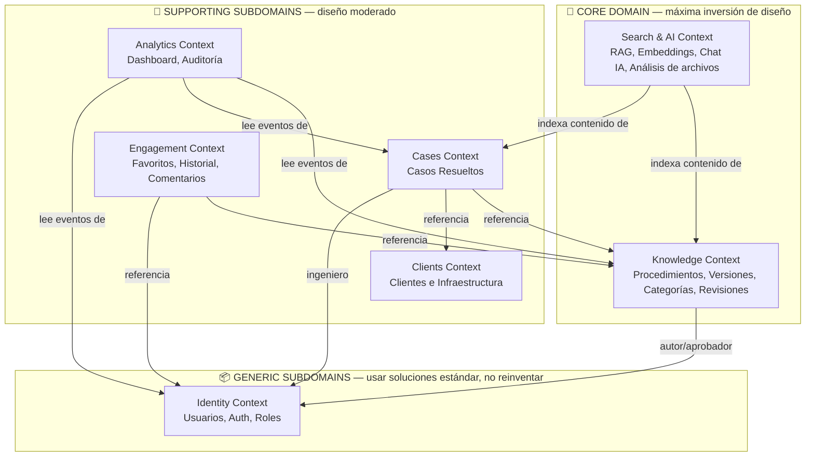
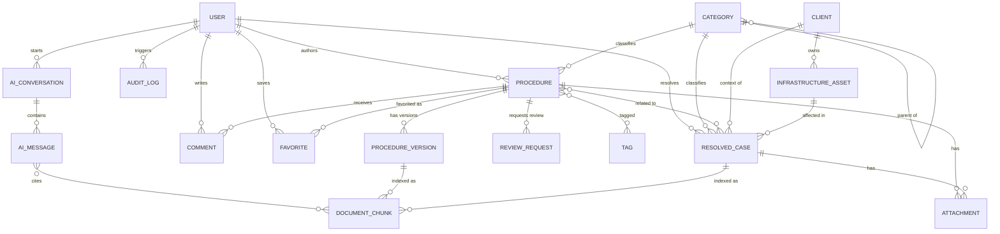
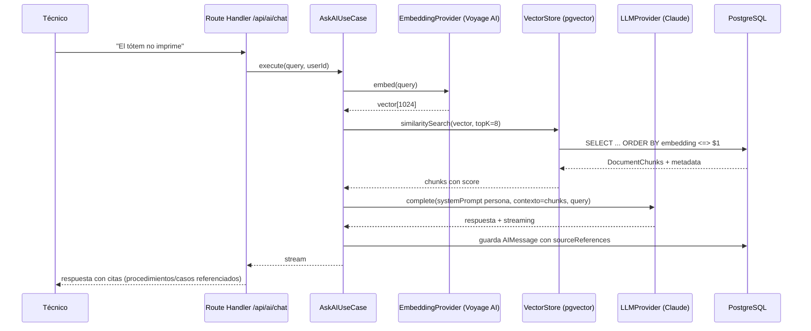

# ZeroQ Support Hub — Arquitectura de Software

**Estado:** Propuesta para validación — ningún código de aplicación ha sido escrito todavía.
**Autor:** Principal Software Architect (Claude)
**Fecha:** 2026-07-23

---

## 1. Resumen del dominio

ZeroQ Support Hub es un **Centro de Conocimiento Inteligente** interno para el área de Soporte
Técnico de ZeroQ (empresa de Queue Management Systems: tótems, módulos de atención, pantallas,
impresoras térmicas, servidores Linux/Docker/PostgreSQL/Redis, para clientes bancarios,
hospitalarios, municipales, retail y gobierno).

No es un ticketing system ni una wiki: es una base documental versionada + búsqueda semántica +
IA (RAG) que actúa como "Ingeniero Senior de Soporte" especializado en el stock de conocimiento de
ZeroQ.

**Tipo de sistema:** Single-tenant (una sola organización: ZeroQ). Los "Clientes" (bancos,
hospitales, etc.) son **datos de dominio**, no tenants — no hay aislamiento de datos entre ellos,
todos los ingenieros de ZeroQ ven todo. Esto simplifica el modelo: no hace falta `tenant_id` ni
row-level security por organización.

**Escala:** MVP. Prioridad: velocidad de desarrollo + bases limpias para escalar sin reescribir.

---

## 2. Principios arquitectónicos

| Principio | Aplicación en este proyecto |
|---|---|
| **Clean Architecture** | El dominio y los casos de uso no conocen Next.js, Prisma, ni proveedores de IA. Las dependencias apuntan siempre hacia adentro (Domain ← Application ← Infrastructure/Interface). |
| **SOLID** | Cada caso de uso = una clase con una responsabilidad (SRP). Nuevos analizadores de archivos o proveedores de IA se agregan sin modificar código existente (OCP). Los repositorios y proveedores externos se consumen vía interfaces (DIP), nunca acoplados a un SDK concreto. |
| **Feature-Based (Screaming Architecture)** | Las carpetas gritan el dominio (`knowledge`, `cases`, `clients`, `search-ai`) y no el framework (`controllers`, `services` a secas). Evita que `src/` se vuelva un cajón de sastre a medida que crecen los 15 módulos listados en el brief. |
| **DDD (táctico donde aplica, estratégico siempre)** | Se identifican Bounded Contexts (sección 3) y Subdominios Core/Support/Generic para decidir dónde invertir diseño rico y dónde usar soluciones estándar. |

---

## 3. Diseño estratégico (DDD) — Bounded Contexts



**Por qué esta clasificación:**
- **Knowledge** y **Search & AI** son el *core domain*: es la razón de ser del producto (reducir
  tiempo de diagnóstico vía conocimiento centralizado + IA). Aquí se justifica modelado DDD rico,
  versionado, agregados, eventos de dominio.
- **Cases, Clients, Engagement, Analytics** son *supporting subdomains*: necesarios pero no
  diferenciadores. Modelo más simple, CRUD orientado a casos de uso, sin sobre-ingeniería.
- **Identity** es *generic subdomain*: autenticación y roles no son un problema que ZeroQ deba
  resolver de forma original. Se apoya en **Auth.js (NextAuth)** + un modelo de roles simple
  (enum), no un motor de permisos dinámico construido a mano (evita deuda técnica por
  sobre-diseño de algo que no es diferenciador).

---

## 4. Módulos → Bounded Context (mapeo de los 15 módulos del brief)

| Módulo del brief | Bounded Context |
|---|---|
| Dashboard | Analytics |
| Base de Conocimiento, Procedimientos, Categorías Técnicas | **Knowledge** (agregado `Procedure`) |
| Documentación | **Knowledge** (agregado `Document`, ver §5.3 — entidad separada de `Procedure`, D5) |
| Casos Resueltos | **Cases** |
| Clientes, Infraestructura | **Clients** |
| Buscador Inteligente, IA | **Search & AI** |
| Favoritos, Historial | **Engagement** (los comentarios quedan dentro de `Procedure`, ver D6) |
| Administración, Configuración | **Identity** (usuarios/roles) + `shared/infrastructure` (config) |
| Auditoría | **Analytics** (o su propio sub-módulo `audit`, ver §9) |

**Nota (2026-07-29):** el módulo **Dashboard** y el bounded context **Cases** + **Clients** (filas
"Dashboard" y "Casos Resueltos"/"Clientes, Infraestructura" de la tabla) se implementaron completos
y luego se eliminaron por completo — sin uso real, pedido explícito del usuario. El diagrama de §3
y esta tabla quedan como registro histórico del diseño original; el estado real del código está en
`ROADMAP.md` (Fase 4) y `AI_RAG_DESIGN.md` §13, con el detalle de qué se borró y por qué.

---

## 5. Entidades y relaciones



### 5.1 Agregados (DDD) y sus invariantes

| Agregado raíz | Entidades/VOs internos | Invariante que protege |
|---|---|---|
| **Procedure** | ProcedureVersion, Comment, ReviewRequest, ProcedureTag | No se puede aprobar (`status=approved`) sin al menos una `ReviewRequest` con status `approved` por un Supervisor Técnico. Solo la versión aprobada más reciente es la "vigente". |
| **ResolvedCase** | Attachment (case-scoped) | Debe referenciar `Category` y opcionalmente `Client`/`InfrastructureAsset`; no puede crearse vacío de `solution`. |
| **Client** | InfrastructureAsset | Un asset siempre pertenece a un client (no huérfanos). |
| **User** | — | Un usuario tiene exactamente un `Role` (enum) en el MVP. |
| **AIConversation** | AIMessage | Cada `AIMessage` de tipo `assistant` debe registrar sus `sourceReferences` (trazabilidad RAG) — nunca responde sin citar de dónde sacó la información. |

`Category`, `Tag`, `Attachment`, `DocumentChunk` son entidades/valor de soporte, no agregados
raíz independientes (se modifican solo a través del agregado dueño, excepto `Category`/`Tag` que
son catálogo compartido de solo-referencia).

### 5.2 Campos clave por entidad (borrador para validar en Prisma schema)

- **User**: id, name, email, passwordHash, role (`admin|supervisor|engineer_l1|engineer_l2|readonly`), active, createdAt
- **Category**: id, name, slug, parentId?, description
- **Procedure**: id, title, slug, categoryId, status (`draft|in_review|approved|deprecated`), riskLevel (`low|medium|high`), estimatedTimeMinutes, currentVersionId, authorId, createdAt, updatedAt
- **ProcedureVersion**: id, procedureId, versionNumber, contentMarkdown, changeSummary, authorId, createdAt
- **ReviewRequest**: id, procedureId, requestedBy, reviewerId?, status (`pending|approved|rejected`), notes, reviewedAt
- **Comment**: id, procedureId, authorId, body, resolved, createdAt
- **Tag**: id, name — join `ProcedureTag(procedureId, tagId)`
- **Attachment**: id, ownerType (`procedure|case`), ownerId, fileType (`image|video|pdf|config|log`), storageKey, uploadedBy, createdAt
- **Client**: id, name, type (`banco|hospital|municipalidad|retail|gobierno|otro`), contactInfo, active
- **InfrastructureAsset**: id, clientId, type (`totem|modulo_atencion|pantalla|impresora|servidor|tv_box|otro`), model, location, serialNumber, metadata (jsonb)
- **ResolvedCase**: id, title, description, clientId?, infrastructureAssetId?, categoryId, engineerId, symptoms, rootCause, solution, timeSpentMinutes, resolvedAt — + join `CaseProcedure(caseId, procedureId)`
- **Favorite**: userId, procedureId, createdAt (PK compuesta)
- **ViewHistory**: id, userId, entityType, entityId, viewedAt
- **AuditLog**: id, userId, action, entityType, entityId, metadata (jsonb), createdAt
- **AIConversation**: id, userId, title?, createdAt
- **AIMessage**: id, conversationId, role (`user|assistant`), content, sourceReferences (jsonb: array de `{type, id, title}`), createdAt
- **DocumentChunk**: id, sourceType (`procedure_version|resolved_case`), sourceId, content, embedding (`vector(1024)`, ver D2), chunkIndex, createdAt

---

## 6. Estructura de carpetas

Clean Architecture **dentro** de cada feature (no por capas globales) — así el proyecto escala a
15+ módulos sin que `src/services/` o `src/controllers/` se conviertan en un cajón de 200 archivos.

```
zeroq-support-hub/
├── src/
│   ├── app/                                # Next.js App Router — SOLO presentación
│   │   ├── (dashboard)/
│   │   │   ├── procedures/[...]/page.tsx
│   │   │   ├── cases/[...]/page.tsx
│   │   │   ├── clients/[...]/page.tsx
│   │   │   ├── search/page.tsx
│   │   │   ├── ai/page.tsx
│   │   │   └── admin/[...]/page.tsx
│   │   ├── api/                            # Route Handlers = controllers delgados
│   │   │   ├── procedures/route.ts
│   │   │   ├── procedures/[id]/route.ts
│   │   │   ├── procedures/[id]/versions/route.ts
│   │   │   ├── cases/route.ts
│   │   │   ├── clients/route.ts
│   │   │   ├── ai/chat/route.ts             # streaming SSE
│   │   │   ├── ai/analyze/route.ts          # análisis de logs/compose/.env/imágenes
│   │   │   ├── search/route.ts
│   │   │   └── auth/[...nextauth]/route.ts
│   │   └── layout.tsx
│   │
│   ├── modules/                            # ⭐ Feature-based, un Bounded Context por carpeta
│   │   ├── knowledge/
│   │   │   ├── domain/
│   │   │   │   ├── entities/               Procedure.ts, ProcedureVersion.ts, ReviewRequest.ts
│   │   │   │   ├── value-objects/          RiskLevel.ts, ProcedureStatus.ts
│   │   │   │   ├── events/                 ProcedureApproved.ts, ProcedureVersionCreated.ts
│   │   │   │   └── ports/                  ProcedureRepository.ts (interface)
│   │   │   ├── application/
│   │   │   │   ├── use-cases/              CreateProcedure.ts, ApproveProcedure.ts, ...
│   │   │   │   ├── policies/                CanApproveProcedure.ts, CanEditProcedure.ts
│   │   │   │   └── dto/
│   │   │   └── infrastructure/
│   │   │       └── persistence/            PrismaProcedureRepository.ts
│   │   │
│   │   ├── cases/                          (mismo patrón: domain/application/infrastructure)
│   │   ├── clients/
│   │   ├── identity/                       Users, roles, policies base, NextAuth adapter
│   │   ├── engagement/                     Favorites, ViewHistory, Comments (si no van en knowledge)
│   │   ├── analytics/                      Dashboard queries, AuditLog
│   │   │
│   │   └── search-ai/                      ⭐ Core domain — Ports & Adapters explícito
│   │       ├── domain/
│   │       │   └── entities/               AIConversation.ts, AIMessage.ts, DocumentChunk.ts
│   │       ├── application/
│   │       │   ├── use-cases/              AskAIUseCase.ts, IndexContentUseCase.ts,
│   │       │   │                           AnalyzeAttachmentUseCase.ts, SemanticSearchUseCase.ts
│   │       │   └── ports/                  LLMProvider.ts, EmbeddingProvider.ts,
│   │       │                               VectorStore.ts, FileAnalyzer.ts
│   │       └── infrastructure/
│   │           ├── llm/                    AnthropicProvider.ts
│   │           ├── embeddings/             VoyageEmbeddingProvider.ts
│   │           ├── vector-store/           PgVectorStore.ts
│   │           └── analyzers/              LogAnalyzer.ts, ComposeAnalyzer.ts,
│   │                                       EnvAnalyzer.ts, ImageAnalyzer.ts
│   │
│   ├── shared/                             # Shared Kernel — framework-agnostic
│   │   ├── domain/                         Entity.ts, AggregateRoot.ts, ValueObject.ts,
│   │   │                                   Result.ts, DomainError.ts, DomainEvent.ts
│   │   ├── application/                    UseCase.ts (interface), EventBus.ts (port)
│   │   └── infrastructure/
│   │       ├── prisma/                     client.ts, BaseRepository.ts
│   │       ├── storage/                    S3Adapter.ts (MinIO/S3-compatible)
│   │       ├── cache/                      RedisAdapter.ts
│   │       ├── jobs/                       BullMQ queues (indexación async)
│   │       ├── events/                     InProcessEventBus.ts
│   │       ├── auth/                       next-auth.config.ts, session.ts
│   │       └── logger/
│   │
│   ├── components/                         # Design system / UI compartida (dumb components)
│   ├── lib/                                # Zod schemas de request/response, api client
│   └── config/                             # env.ts (validación Zod de variables de entorno)
│
├── prisma/
│   ├── schema.prisma
│   └── migrations/
├── docs/
│   └── architecture/                       ADRs, este documento
└── tests/
    ├── unit/                               domain + application (sin infra)
    └── integration/                        infrastructure + route handlers
```

**Regla dura:** nada en `modules/*/domain` o `modules/*/application` puede importar de `next/*`,
`@prisma/client`, SDKs de IA, `aws-sdk`, etc. Esas capas solo conocen TypeScript puro + los ports
del propio módulo o de `shared/domain`. Esto es lo que permite testear casos de uso sin base de
datos ni red, y cambiar de proveedor de IA sin tocar dominio.

---

## 7. Server Components vs Route Handlers (decisión clave de Next.js)

Un error común que genera deuda técnica: hacer que los Server Components llamen a su **propia**
API vía `fetch('/api/...')`, agregando una vuelta HTTP innecesaria.

**Regla adoptada:**
- **Server Components** invocan los *use cases* de `modules/*/application` **directamente**,
  en proceso (son server-side, no necesitan HTTP).
- **Route Handlers** (`app/api/**`) existen solo para: (a) llamadas desde Client Components
  (interactividad), (b) streaming de IA (SSE/fetch streaming), (c) webhooks externos, (d) una
  eventual API pública futura.
- Ambos caminos llaman a los **mismos use cases** — el Route Handler es un adaptador delgado que
  traduce HTTP ⇄ use case (parsea con Zod, llama al use case, mapea `Result` a `NextResponse`),
  nunca contiene lógica de negocio.

---

## 8. Patrones aplicados y por qué

| Patrón | Dónde | Justificación |
|---|---|---|
| **Ports & Adapters (Hexagonal)** | `search-ai` (LLMProvider, EmbeddingProvider, VectorStore, FileAnalyzer), `shared/infrastructure/storage` (S3Adapter) | Evita vendor lock-in. Cambiar de Anthropic a otro LLM, o de MinIO a S3, es escribir un adapter nuevo, no tocar casos de uso. Crítico porque el mercado de IA cambia rápido. |
| **Repository** | Un repositorio por agregado raíz | Aísla el dominio de Prisma. Los use cases dependen de la interfaz (`ProcedureRepository`), no de `PrismaClient`. |
| **Use Case / Interactor** | `application/use-cases/*` | Cada acción del brief ("Aprobar documentación", "Crear procedimiento") es una clase con un método `execute()`. Un caso de uso = una responsabilidad = fácil de testear y de leer. |
| **Policy / Guard object** | `application/policies/*` | Los 5 roles con permisos distintos se resuelven con objetos `CanX.check(user, resource)` en vez de `if (user.role === 'admin')` disperso. Nuevas reglas de permiso no tocan código existente (OCP). |
| **Strategy** | `search-ai/infrastructure/analyzers/*` (Log, Compose, Env, Image) | El brief pide analizar tipos de archivo muy distintos. Un `FileAnalyzer` por tipo, seleccionado por `AnalyzeAttachmentUseCase` según `fileType`. Agregar un analizador nuevo no modifica los existentes. |
| **Domain Events** | `ProcedureApproved`, `ProcedureVersionCreated`, `ResolvedCaseCreated` | Desacoplan "guardar el procedimiento" de "reindexar para RAG" y de "escribir auditoría". El use case solo emite el evento; los listeners (en infrastructure) hacen el trabajo pesado async. |
| **CQRS ligero (sin Event Sourcing)** | `analytics` (Dashboard), `search-ai` (búsqueda) | Las lecturas de alto volumen (dashboard, listados, búsqueda) usan queries de solo lectura optimizadas (SQL directo o vistas), sin pasar por la hidratación completa de agregados de dominio. Las escrituras sí pasan por agregados + invariantes. |
| **Decorator (para auditoría)** | `shared/application` — `AuditedUseCase` wrapper | En vez de llamar `auditLog.write(...)` a mano en cada use case (se olvida, se duplica), se envuelve la ejecución de use cases sensibles con un decorator que registra automáticamente quién hizo qué. |
| **Result/Either (sin excepciones para flujo de negocio)** | Todos los use cases devuelven `Result<T, DomainError>` | Los errores de negocio ("no tienes permiso", "la versión ya fue aprobada") son valores, no `throw`. Excepciones quedan reservadas para errores realmente excepcionales (infra caída). |

---

## 9. Arquitectura RAG / IA (núcleo diferenciador)



**Pipeline de indexación (asíncrono, disparado por Domain Events):**

`ProcedureApproved` / `ProcedureVersionCreated` / `ResolvedCaseCreated`
→ job en cola (BullMQ) → extrae texto → chunking (~500 tokens, overlap) → `EmbeddingProvider.embed()`
→ `INSERT INTO document_chunks (..., embedding)`.

Solo se indexa contenido **aprobado** (`Procedure.status = approved`) — evita que la IA cite
procedimientos en borrador o rechazados, protegiendo la confiabilidad de las respuestas.

**Análisis de archivos** (logs, docker-compose, .env, imágenes): un `AnalyzeAttachmentUseCase`
único que delega en el `FileAnalyzer` correspondiente (Strategy, ver §8) y opcionalmente enriquece
la respuesta con contexto RAG (ej. "este error de Docker ya se resolvió en el Caso #124").

**Trazabilidad:** cada `AIMessage` de tipo assistant guarda `sourceReferences` — nunca se permite
una respuesta de IA sin poder mostrar de qué documento salió. Esto es un requisito de confianza
explícito del brief ("responder... utilizando exclusivamente la documentación interna").

---

## 10. Decisiones tecnológicas

| Decisión | Elección | Justificación |
|---|---|---|
| Framework fullstack | Next.js (App Router) + Route Handlers | Definido por el usuario. |
| Lenguaje | TypeScript estricto | Único lenguaje entre front/back; tipos compartidos entre capas. |
| Base de datos | PostgreSQL | Ya es parte del stack que ZeroQ opera en sus clientes (conocimiento interno reutilizable) + soporta `pgvector`. |
| Vector store | **pgvector sobre el mismo PostgreSQL** (no un vector DB separado) | MVP: evita operar un servicio adicional (Pinecone/Qdrant/Weaviate). Un único punto de backup/consistencia transaccional entre datos y embeddings. Migrable después si el volumen lo justifica. |
| ORM | Prisma, con `$queryRaw` puntual para similarity search (`<=>`) | Mejor DX/migraciones del ecosistema Next.js; Prisma no modela nativamente `vector`, se resuelve con raw SQL encapsulado *dentro* del adapter `PgVectorStore` (el resto de la app no lo ve). |
| LLM | **Swappable en runtime entre Claude, OpenAI, Ollama y Azure OpenAI** (`LLM_PROVIDER` en `.env`, sin tocar código) — implementado vía Vercel AI SDK (`ai` + `@ai-sdk/anthropic`/`@ai-sdk/openai`/`@ai-sdk/azure`/`ollama-ai-provider-v2`), un único adapter (`VercelAiLLMProvider`) + una factory. Default: Claude. | Requisito agregado explícitamente al pedir la implementación de Fase 5 (no estaba en el diseño original de Fase 1) — "no debe depender de un proveedor específico". Los 4 SDKs implementan la misma spec `LanguageModelV2`, por eso un solo adapter alcanza; swap de proveedor es un cambio de `.env`, no de código. |
| Embeddings | Voyage AI (`voyage-4-lite`, D2) | Recomendado por Anthropic para RAG (Anthropic no ofrece embeddings propios). Fijo, no swappable por config a diferencia del LLM — cambiar de proveedor de embeddings implica re-embeber todo el corpus, ver AI_RAG_DESIGN.md §2. |
| Streaming de chat IA | **Diferido** — `AskAIUseCase` usa `generateText`+`Output.object` (respuesta completa, no token a token) | Simplificación de alcance al implementar Fase 5 (ver AI_RAG_DESIGN.md §13, punto 3) — UI_UX_DESIGN.md §6.1 seguía pidiendo streaming; se dejó como fast-follow acotado a `VercelAiLLMProvider`+`AskAIUseCase`+la UI del chat, no bloquea el resto de la arquitectura. |
| Almacenamiento de archivos | MinIO (self-hosted, S3-compatible) | ZeroQ ya opera Linux/Docker en sus clientes — cero fricción operativa, sin costo de vendor cloud, y el adapter es idéntico a S3 real si migran después. |
| Cache / rate limiting | Redis | Ya está en el stack de ZeroQ. Cachea búsquedas frecuentes y limita costo de llamadas a IA por usuario. |
| Jobs asíncronos (indexación RAG, notificaciones) | BullMQ + Redis (self-hosted) | ZeroQ ya tiene expertise operando Redis/Docker — bajo costo de adopción. Evita bloquear el request de "aprobar procedimiento" con el trabajo de embeddings. |
| Autenticación | Auth.js (NextAuth v5 beta), Credentials, **sin** adapter Prisma | Generic subdomain: no reinventar auth. **Corrección post-investigación (Fase Authentication, Context7):** Auth.js fuerza sesión JWT cuando se usa el provider Credentials — no persiste usuarios vía adapter en ese modo, así que no hacen falta tablas `Account`/`Session`/`VerificationToken`. Mitigación acordada para poder revocar accesos rápido (dato sensible: infraestructura de bancos/hospitales): JWT de vida corta (8h) + el callback `jwt` re-verifica `User.active` contra la base en cada request: si el usuario fue desactivado, la sesión se invalida casi de inmediato aunque técnicamente no sea una sesión persistida en DB. |
| Autorización | Roles como enum + `Policy objects` en application layer | 5 roles fijos y conocidos de antemano (no hay caso de negocio para permisos dinámicos hoy). Camino de escalamiento documentado en D4. |
| Validación de entrada | Zod en el borde (Route Handlers) | Mantiene el dominio libre de dependencias de validación de request; Zod además infiere tipos para el `lib/` compartido. |

---

## 11. Decisiones D1–D7 — resueltas (Fase 1, 2026-07-23)

Cerradas por el Arquitecto Principal para poder avanzar al diseño completo de Fase 1. Van dentro
del paquete que se aprueba al final de Fase 1 — si alguna no te convence, se revierte antes de
tocar código, el costo de cambiarla ahora es cero.

1. **D1 — ORM/consulta vectorial → Prisma**, con `$queryRaw` encapsulado dentro de `PgVectorStore`.
   Se mantiene la elección original de §10; Drizzle no se justifica solo por el tipo `vector`
   cuando el resto de la app se beneficia de la DX de migraciones de Prisma.
2. **D2 — CERRADO (ver `AI_RAG_DESIGN.md` §2): Embeddings → Voyage AI `voyage-4-lite` (1024 dims),
   fijo, no swappable.** Confirmado con el usuario al diseñar Fase 5. Corrección respecto a la
   propuesta original de esta sección: `voyage-3` ya no es el modelo recomendado vigente (verificado
   por Context7). El modelo pasó primero a `voyage-3.5` (mismo default de 1024 dims, sin cambio de
   schema) y luego, al implementar, a `voyage-4-lite` — `voyage-3.5` resultó quedar reclasificado
   como "modelo antiguo" sin tokens gratis, mientras `voyage-4-lite` tiene 200M tokens gratis por
   cuenta y comparte los mismos 1024 dims (switch sin costo, hecho antes de que existiera ningún
   embedding real). Se mantiene Voyage sobre OpenAI porque Anthropic (el LLM
   elegido) no ofrece embeddings propios y lo recomienda como partner; el `EmbeddingProvider` port
   sigue haciendo trivial un adapter OpenAI (`zeroq-openai`) si se necesita como proveedor
   secundario. Recordatorio que se mantiene: una vez existan `document_chunks` con datos reales,
   cambiar de proveedor implica re-embeber todo el corpus.
3. **D3 — Storage → MinIO self-hosted.** Coherente con la infraestructura Linux/Docker que ZeroQ ya
   opera; sin costo de vendor cloud.
4. **D4 — RBAC → roles fijos por enum + Policy objects.** Sin permisos granulares configurables en
   Fase 1 (YAGNI): los 5 roles del brief son conocidos y estables. Camino de escalamiento a
   permisos-en-base-de-datos documentado en `zeroq-security` sin tocar los use cases que consumen
   las políticas.
5. **D5 — "Documentación" vs "Procedimientos" → entidades separadas.** El propio brief distingue
   "Documenta procedimientos" (Ingeniero N2) de "Sube manuales" (Ingeniero N2, acción distinta) —
   son cosas distintas: un `Procedure` es contenido propio, versionado y con flujo de aprobación;
   un `Document` es material de referencia de terceros (manual de fabricante, datasheet, PDF) sin
   versionado ni revisión, solo reemplazo por re-subida. Se agrega la entidad `Document` al
   contexto Knowledge (ver §5.3 más abajo).
6. **D6 — Engagement → módulo propio**, pero acotado: `Comment` se queda dentro del agregado
   `Procedure` (ya modelado así en §5.1, se lee siempre junto al procedimiento). `Favorite` y
   `ViewHistory` sí son transversales por usuario y viven en `modules/engagement` — desacoplan datos
   de interacción personal de los agregados de conocimiento sin forzar una indirección donde no
   aporta (el comentario).
7. **D7 — Jobs asíncronos → BullMQ + Redis self-hosted.** ZeroQ ya opera Docker/Linux/Redis en
   producción para sus clientes (y ya instalamos la skill `n8n-self-hosting`, señal de que el plan
   es seguir auto-alojando infraestructura) — no hay razón para asumir un despliegue serverless que
   complicaría un worker persistente sin necesidad real.

### 5.3 Entidad adicional — `Document` (resultado de D5)

- **Document**: id, title, categoryId, clientId? (si es manual de un equipo de cliente específico),
  fileType (`manual|datasheet|firmware_notes|otro`), storageKey, uploadedBy, supersedes (Document?
  autorreferencia — la re-subida marca la anterior como reemplazada, no la versiona), createdAt.
- No tiene `ReviewRequest` ni `ProcedureVersion` — es contenido de referencia, no conocimiento
  propio de ZeroQ. Sí se indexa para RAG igual que `ProcedureVersion`/`ResolvedCase` (agregar
  `sourceType: 'document'` a `DocumentChunk`), porque un manual de fabricante es tan útil para
  responder una pregunta técnica como un procedimiento propio — pero el `AskAIUseCase` debe
  distinguir en la cita si la fuente es contenido propio revisado o un manual externo, para que el
  técnico calibre la confianza igual.

---

## 12. Escalabilidad y evolución (evitar deuda técnica futura)

- **Monolito modular → microservicios:** cada `module/*` ya está aislado por `domain/application`
  puros + `infrastructure` con adapters. Si `search-ai` necesita escalar independientemente
  (ej. picos de uso de IA), se extrae a un servicio propio reutilizando el mismo
  `application/use-cases` casi sin cambios — el Route Handler pasaría a ser un proxy HTTP.
- **Multi-tenant futuro:** aunque no se implementa ahora, el diseño no lo bloquea — si ZeroQ algún
  día vende este Hub a otra empresa, agregar `organizationId` a las entidades raíz es un cambio de
  schema localizado, no una reescritura, porque no hay lógica de negocio acoplada a "una sola
  organización" en el dominio.
- **RBAC:** el uso de `Policy objects` en vez de `if/else` disperso permite migrar de roles-enum a
  permisos-en-base-de-datos (D4) reemplazando la implementación de las políticas sin tocar los use
  cases que las consumen.
- **Vector store:** si pgvector no escala (millones de chunks, latencia), el `VectorStore` port ya
  aísla esa dependencia — migrar a Qdrant/Pinecone es un adapter nuevo.

---

## Siguiente paso

Con tus respuestas a §11 puedo: (1) finalizar `prisma/schema.prisma`, (2) documentar el primer ADR
formal, y recién ahí empezar implementación módulo por módulo — empezando por `identity` +
`knowledge` (son la base de la que todo lo demás depende).
